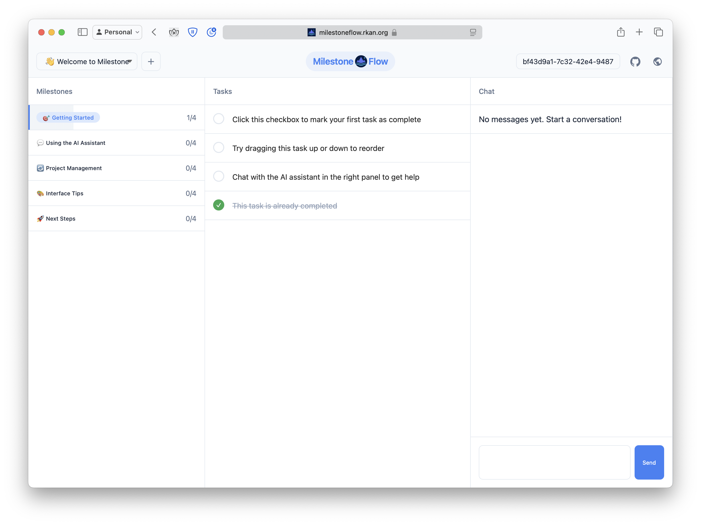

# MilestoneFlow

MilestoneFlow is a modern, AI-powered project management tool that helps users organize projects through milestones and tasks. Built with SvelteKit and integrated with GPT-4, it provides an intuitive interface for managing project workflows while leveraging AI assistance for project planning and task organization.

You can find a hosted instance at [milestoneflow.rkan.org](https://milestoneflow.rkan.org). Keep in mind this is an early release which might be buggy and incomplete.



## Features

### 🎯 Core Functionality
- **Project Management**: Create and manage multiple projects with milestones and tasks
- **Drag-and-Drop Tasks**: Intuitive task reordering within milestones
- **Progress Tracking**: Visual progress indicators for milestones and tasks
- **Real-time Updates**: Instant UI updates when modifying project structure

### 🤖 AI Integration
- **Intelligent Assistant**: GPT-4o powered chat interface for project management
- **Context-Aware**: AI understands your project structure and can make targeted updates
- **Natural Language**: Make changes to your project structure through natural conversation

### 💾 Data Persistence
- **Supabase Backend**: Secure data storage with Supabase
- **User Management**: UUID-based user identification
- **Chat History**: Persistent chat history per project
- **Real-time Sync**: Automatic saving of all changes

### 🎨 User Interface
- **Modern Design**: Clean, intuitive interface with careful attention to detail
- **Responsive Layout**: Adapts to different screen sizes
- **Visual Feedback**: Smooth animations and transitions

## Technical Stack

- **Frontend**: SvelteKit (deployed on Vercel)
- **Database**: Supabase
- **AI**: GPT-4o

## Getting Started

### Prerequisites

- Node.js (v18 or later)
- npm or pnpm
- Supabase account
- OpenAI API key

### Environment Setup

Create a `.env` file in the root directory:

```env
PUBLIC_SUPABASE_URL=your_supabase_url
SUPABASE_SERVICE_ROLE_KEY=your_supabase_service_key
OPENAI_API_KEY=your_openai_api_key
```

### Database Setup

Create the following tables in your Supabase database:

```sql
-- User data table
create table user_data (
  user_id text primary key,
  markdown text default '',
  created_at timestamp with time zone default timezone('utc'::text, now()) not null
);

-- Chat messages table
create table chat_messages (
  id uuid default uuid_generate_v4() primary key,
  user_id text not null,
  project_title text not null,
  role text not null,
  content text not null,
  created_at timestamp with time zone default timezone('utc'::text, now()) not null
);
```

### Installation

```bash
# Clone the repository
git clone https://github.com/yourusername/milestone-flow.git
cd milestone-flow

# Install dependencies
npm install

# Start development server
npm run dev
```

## Usage

### Creating a Project
1. Click the "+" button in the project selector
2. Enter your project details
3. Start adding milestones and tasks

### Using AI Assistance
1. Describe your desired changes in natural language in the chat
2. AI will update your project structure accordingly

### Managing Tasks
- Click checkboxes to mark tasks complete
- Drag and drop tasks to reorder
- Use the chat to add or modify tasks
